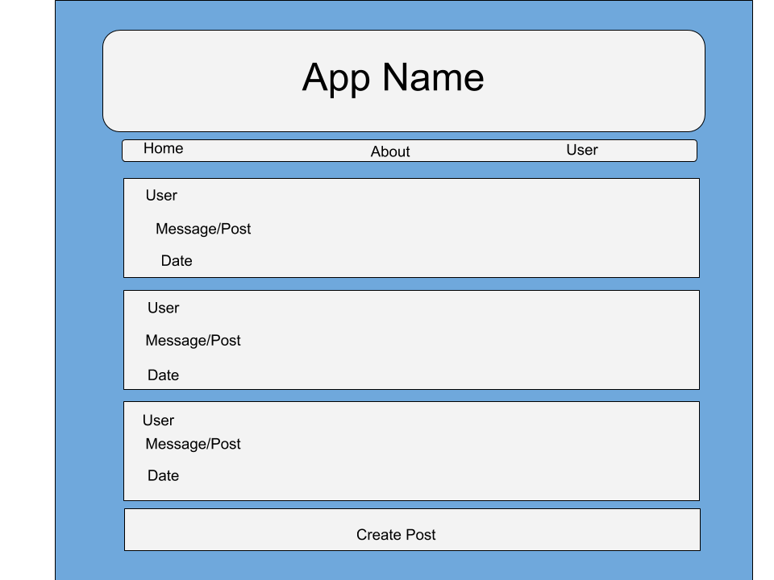
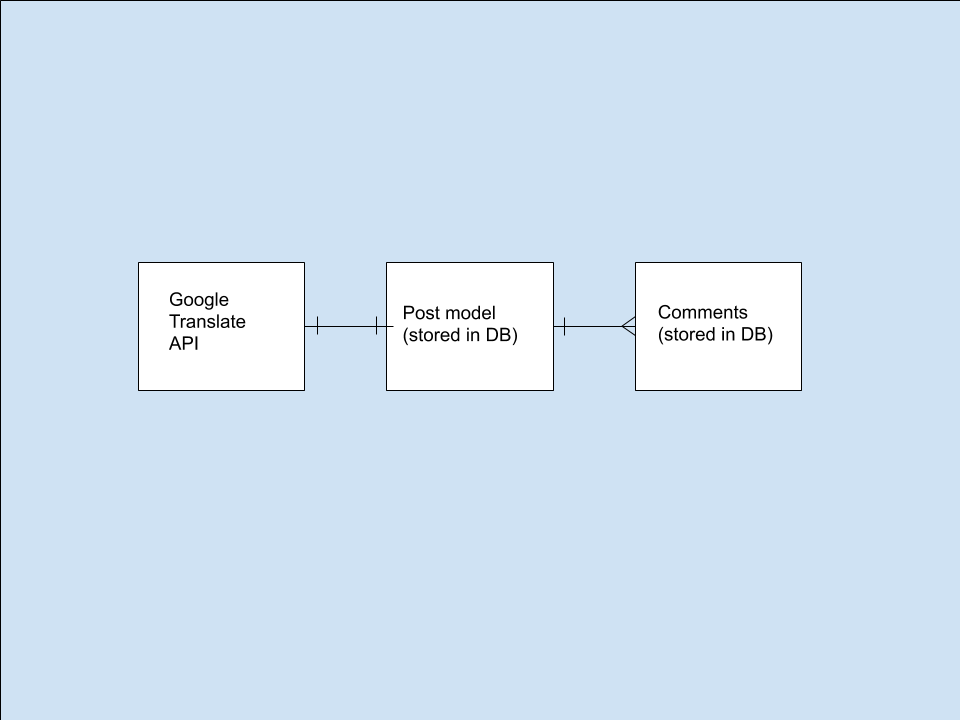

# GA-SEI-Project-3
The purpose of this app is mostly to have fun. It operates similarly to a game of 'chinese telephone'. the layout is set up similarly to a message posting board with the ability to choose a username, post messages, & comment on your own, or others messages. The catch, is that when you submit your post, it gets sent to google's translate API, & is translated through 6 different languages, before being converted back into English & posted. This results in a noticeably different post than what was submitted, hence the name, "lost in Translation!". 

Deployed web app address: https://lost-in-translation-app.herokuapp.com/
Git Hub Repository: https://github.com/Mshea424/GA-SEI-Project-3
Project Board: https://github.com/Mshea424/GA-SEI-Project-3/projects/1
Wireframe: 
ERD: 